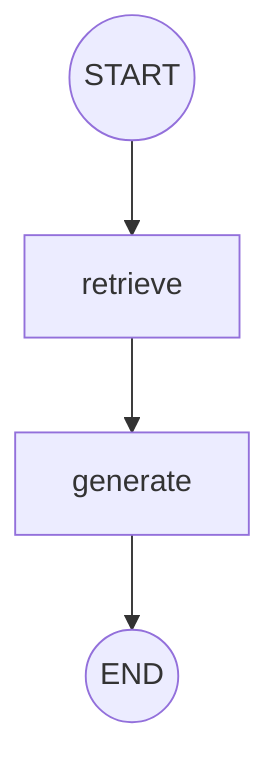
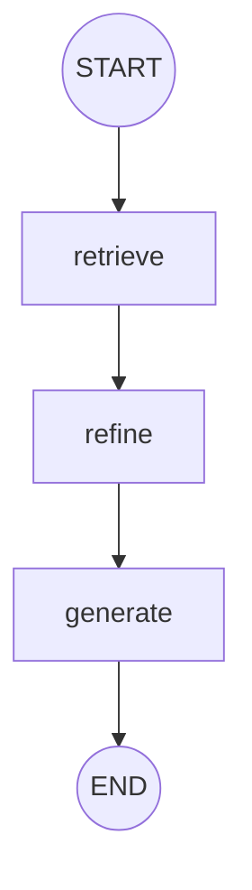
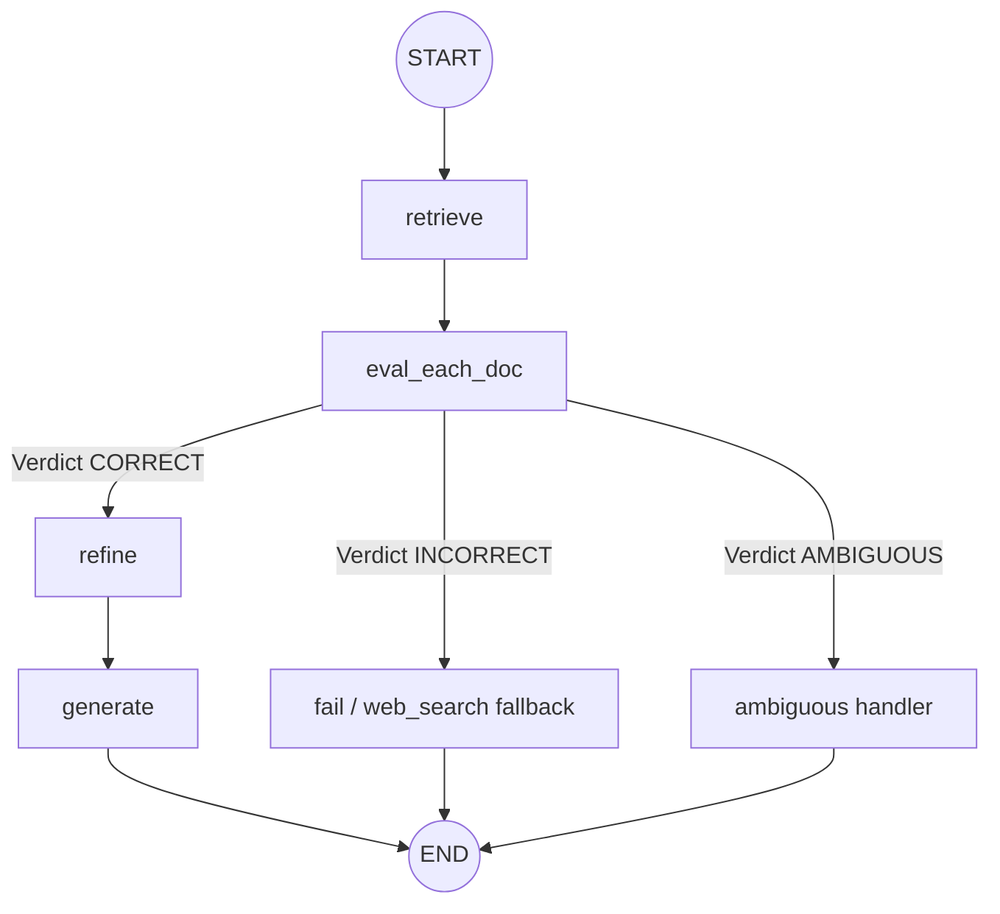
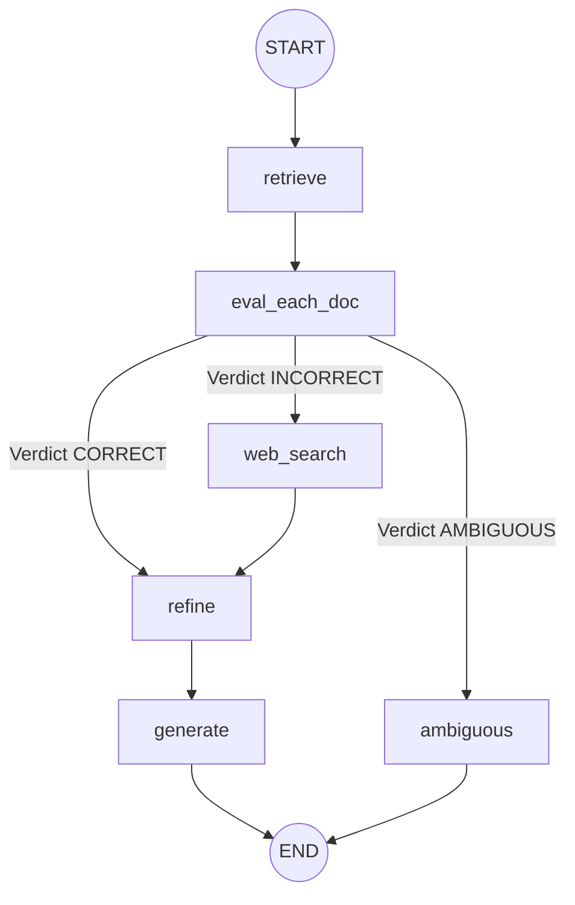
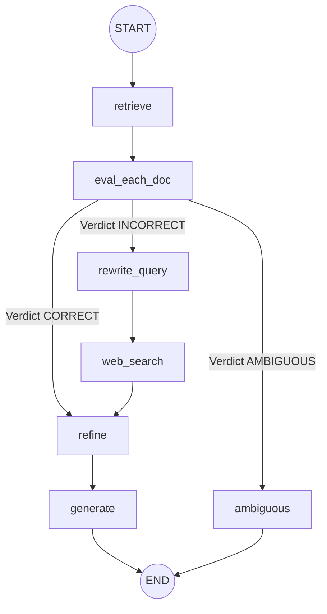
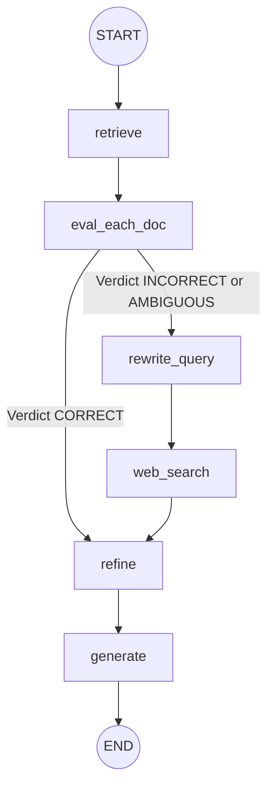

# Corrective RAG (CRAG) Implementation

This repository is dedicated to building and documenting a complete Corrective Retrieval-Augmented Generation (CRAG) pipeline. CRAG enhances standard RAG systems by introducing an evaluation and correction step: it grades the relevance of retrieved documents, performs query rewriting, and utilizes web search fallbacks when local documents are insufficient.

---

## Project Roadmap

Our implementation progresses from a simple baseline to a fully corrective graph workflow:
1. **Basic RAG**: Implement document loading, vector storage, retrieval, and generation using LangChain and LangGraph. (Completed in [1_basic_rag.ipynb](1_basic_rag.ipynb))
2. **Retrieval Refinement**: Add document parsing, sentence decomposition, and sentence-level relevance grading/filtering using an LLM to select only the sentences that directly address the user query. (Completed in [2_retrieval_refinement.ipynb](2_retrieval_refinement.ipynb))
3. **Retrieval Evaluation & Routing**: Introduce a retrieval evaluator node that scores retrieved chunks and determines a verdict (`CORRECT`, `INCORRECT`, or `AMBIGUOUS`) to dynamically route the query context downstream. (Completed in [3_retrieval_evaluator.ipynb](3_retrieval_evaluator.ipynb))
4. **Web Search Integration & Refinement (CRAG)**: Integrate live Tavily Web Search as a fallback when local database retrieval is `INCORRECT`, running sentence-level context refinement over web search results. (Completed in [4_web_search_refinement.ipynb](4_web_search_refinement.ipynb))
5. **Query Rewriting**: Introduce a query rewriter node before executing web search when the evaluation verdict is `INCORRECT`. The LLM rewrites raw user questions into optimized web search queries (keywords, time constraints, etc.) for improved web document retrieval. (Completed in [5_query_rewrite.ipynb](5_query_rewrite.ipynb))
6. **[Current] Ambiguous Verdict & Dual-Source Refinement**: Handle `AMBIGUOUS` verdicts by rewriting the query, searching the web, combining both internal (`good_docs`) and external (`web_docs`) documents for sentence-level context refinement, and generating the final response. (Completed in [6_ambiguous.ipynb](6_ambiguous.ipynb))

---

## Repository Structure

- [1_basic_rag.ipynb](1_basic_rag.ipynb): Jupyter Notebook containing the initial phase—a basic RAG pipeline orchestrated using LangGraph.
- [2_retrieval_refinement.ipynb](2_retrieval_refinement.ipynb): Jupyter Notebook containing the second phase—Retrieval Refinement with sentence-level relevance grading.
- [3_retrieval_evaluator.ipynb](3_retrieval_evaluator.ipynb): Jupyter Notebook containing the third phase—Retrieval Evaluation & Routing logic of Corrective RAG.
- [4_web_search_refinement.ipynb](4_web_search_refinement.ipynb): Jupyter Notebook containing the fourth phase—Web Search Integration using Tavily Search with sentence-level context refinement.
- [5_query_rewrite.ipynb](5_query_rewrite.ipynb): Jupyter Notebook containing the fifth phase—Query Rewriting before web search integration.
- [6_ambiguous.ipynb](6_ambiguous.ipynb): Jupyter Notebook containing the sixth phase—handling `AMBIGUOUS` verdicts using dual-source context refinement (internal + web search).
- `.gitignore`: Configured to ignore virtual environments, cache files, environment variables, and local Jupyter checkpoints.

---

## Phase 1: Basic RAG Architecture

The baseline implementation in [1_basic_rag.ipynb](1_basic_rag.ipynb) consists of the following components:

### 1. Ingestion & Embedding Pipeline
- **Document Loading**: PyPDFLoader is used to read documents from a local `./documents/` directory.
- **Text Splitting**: Splits PDF texts using `RecursiveCharacterTextSplitter` with:
  - `chunk_size = 900`
  - `chunk_overlap = 150`
- **Vector Store**: Embeds chunks using OpenAI's `text-embedding-4-small` model and stores them in a local `FAISS` vector database.
- **Retriever**: Performs similarity search returning the top k = 4 most relevant chunks.

### 2. LangGraph Execution Workflow
The agent architecture uses LangGraph to manage state transitions.



- **State Representation**:
  ```python
  class State(TypedDict):
      question: str
      docs: List[Document]
      answer: str
  ```
- **Nodes**:
  - `retrieve`: Invokes the FAISS retriever and updates the state with the retrieved documents.
  - `generate`: Generates an answer using the `gpt-4o-mini` model prompted to answer strictly from the retrieved context.

---

## Phase 2: Retrieval Refinement Architecture

The implementation in [2_retrieval_refinement.ipynb](2_retrieval_refinement.ipynb) focuses on minimizing noise in the context passed to the LLM. Instead of sending the full content of retrieved documents to the LLM, the context is broken down into individual sentences (strips), graded for relevance, and only the relevant sentences are used.

### 1. Ingestion Pipeline Updates
- **Source Books**: Loads `./documents/book1.pdf`, `./documents/book2.pdf`, and `./documents/book3.pdf`.
- **UTF-8 Sanitization**: Cleanses text chunks by ignoring non-UTF-8 characters during splitter preprocessing.
- **Embeddings**: Uses OpenAI's `text-embedding-3-small` embeddings and local `FAISS` index (`k = 4`).

### 2. LangGraph Execution Workflow with Refinement Node



- **Extended State Representation**:
  ```python
  class State(TypedDict):
      question: str
      docs: List[Document]
      strips: List[str]            # Decomposed sentence strips
      kept_strips: List[str]       # Sentences matching relevance criteria
      refined_context: str         # Recomposed internal knowledge context
      answer: str
  ```

- **Nodes**:
  - `retrieve`: Retrieves the top 4 documents matching the query.
  - `refine`: Performs sentence-level filtering:
    1. Splits the retrieved context into sentences using regex: `re.split(r"(?<=[.!?])\s+", text)`. Discards sentences <= 20 characters.
    2. Runs each sentence strip through an LLM relevance classifier (`KeepOrDrop` model using `gpt-4o-mini` structured output).
    3. Joins the kept sentences together into `refined_context`.
  - `generate`: Generates a response strictly based on `refined_context`. If no context was kept, it returns a fallback message: *"I don't know based on the provided books."*

---

## Phase 3: Retrieval Evaluation & Routing Architecture

The implementation in [3_retrieval_evaluator.ipynb](3_retrieval_evaluator.ipynb) adds a scoring and decision-making step to classify the retrieved documents and route the query accordingly.

### 1. Relevance Scoring
- **LLM Evaluator**: Chunks are individually graded by `gpt-4o-mini` using structured output (`DocEvalStore` containing `score` and `reason`).
- **Verdict Rules**:
  - **CORRECT**: If at least one retrieved chunk scores above the upper threshold (`upper_t = 0.7`).
  - **INCORRECT**: If all retrieved chunks score below the lower threshold (`lower_t = 0.3`).
  - **AMBIGUOUS**: Mixed relevance signals (no chunk > `upper_t`, but not all < `lower_t`).

### 2. LangGraph Execution Workflow with Routing



- **Extended State Representation**:
  ```python
  class State(TypedDict):
      question: str
      docs: List[Document]
      good_docs: List[Document]    # Documents meeting evaluation threshold
      verdict: str                 # CORRECT, INCORRECT, or AMBIGUOUS
      reason: str                  # Explanation for verdict
      strips: List[str]            # Decomposed sentence strips
      kept_strips: List[str]       # Sentences matching relevance criteria
      refined_context: str         # Recomposed internal knowledge context
      answer: str
  ```

- **Nodes**:
  - `retrieve`: Retrieves relevant documents from FAISS index.
  - `eval_each_doc`: Evaluates all retrieved documents using structured criteria.
  - `refine`: Sentence decomposition and filtering of good documents.
  - `generate`: Generates tutor response using `refined_context`.
  - `fail`: Fallback node that logs/outputs a failure message (intended for web search integration).
  - `ambiguous`: Handles mixed signals and outputs a clarifying message.

---

## Phase 4: Web Search Refinement Architecture

The implementation in [4_web_search_refinement.ipynb](4_web_search_refinement.ipynb) completes the core Corrective RAG loop by integrating live Tavily Web Search when local document retrieval yields an `INCORRECT` verdict. Web search results are processed through sentence-level decomposition and filtering before response generation.

### 1. Key Highlights & Updates
- **Embeddings**: Upgraded to `text-embedding-3-large` for FAISS vector storage.
- **Tavily Integration**: Utilizes `TavilySearchResults(max_results=5)` to fetch real-time web context when local books lack relevant information.
- **Dynamic Context Routing**:
  - `CORRECT` verdict: Routes `good_docs` to `refine`.
  - `INCORRECT` verdict: Triggers `web_search_node`, converts web search results into `Document` objects stored in `web_docs`, then passes them to `refine`.
  - `AMBIGUOUS` verdict: Directly routes to `ambiguous_node`.

### 2. LangGraph Execution Workflow



- **Extended State Representation**:
  ```python
  class State(TypedDict):
      question: str
      docs: List[Document]
      good_docs: List[Document]
      verdict: str
      reason: str
      strips: List[str]
      kept_strips: List[str]
      refined_context: str
      web_docs: List[Document]     # Web search document results
      answer: str
  ```

- **Nodes**:
  - `retrieve`: Retrieves relevant documents from local FAISS vector store.
  - `eval_each_doc`: Evaluates document chunks using structured LLM output and assigns `verdict` (`CORRECT`, `INCORRECT`, or `AMBIGUOUS`).
  - `web_search`: Invokes Tavily Web Search with the user query, creating `web_docs` containing `TITLE`, `URL`, and `CONTENT`.
  - `refine`: Extracts sentence strips from either `good_docs` (if `CORRECT`) or `web_docs` (if `INCORRECT`), running LLM filter `filter_chain` (`KeepOrDrop`) to produce `refined_context`.
  - `generate`: Generates an answer using `gpt-4o-mini` strictly based on `refined_context`.
  - `ambiguous`: Returns a warning message explaining why the query could not be definitively answered.

---

## Phase 5: Query Rewriting Architecture

The implementation in [5_query_rewrite.ipynb](5_query_rewrite.ipynb) introduces a query rewriting step before performing web search. When the retrieval verdict is `INCORRECT`, raw user questions are transformed by an LLM into concise, search-optimized keyword queries (including recency constraints if applicable) to improve web retrieval quality.

### 1. Key Highlights & Updates
- **Structured Query Generation**: Uses `WebQuery` Pydantic model with structured output (`rewrite_chain`) to formulate web queries.
- **Rewriting Rules**:
  - Converts questions to short keyword queries (6–14 words).
  - Automatically appends recency constraints (e.g., `last 30 days`) if recency is implied in the user prompt.
- **State & Fallback**:
  - Adds `web_query: str` to `State`.
  - `web_search_node` checks `state.get("web_query")` and falls back to `state["question"]` if unavailable.

### 2. LangGraph Execution Workflow



- **Extended State Representation**:
  ```python
  class State(TypedDict):
      question: str
      docs: List[Document]
      good_docs: List[Document]
      verdict: str
      reason: str
      strips: List[str]
      kept_strips: List[str]
      refined_context: str
      web_docs: List[Document]
      web_query: str               # Optimized web search query string
      answer: str
  ```

- **Nodes**:
  - `retrieve`: Retrieves top `k=4` documents from FAISS index.
  - `eval_each_doc`: Grades retrieved documents and sets `verdict`.
  - `rewrite_query`: Invokes `rewrite_chain` to produce an optimized web search query stored in `web_query`.
  - `web_search`: Uses Tavily Search with `web_query` (or fallback to `question`) to populate `web_docs`.
  - `refine`: Decomposes and filters context from either `good_docs` or `web_docs` into `refined_context`.
  - `generate`: Synthesizes final response strictly from `refined_context`.
  - `ambiguous`: Handles `AMBIGUOUS` verdict cases.

---

## Phase 6: Ambiguous Verdict & Dual-Source Refinement Architecture

The implementation in [6_ambiguous.ipynb](6_ambiguous.ipynb) addresses the `AMBIGUOUS` verdict scenario. When local retrieval yields mixed relevance signals (no document chunk > `UPPER_TH` of 0.7, but not all chunks < `LOWER_TH` of 0.3), the system combines both internal weakly relevant documents (`good_docs`) and external web search results (`web_docs`) into a single context pool for sentence-level refinement and response generation.

### 1. Key Highlights & Routing Logic
- **Dual-Source Knowledge Pooling in `refine`**:
  - `CORRECT` verdict: Uses internal documents (`good_docs`) only.
  - `INCORRECT` verdict: Uses web search documents (`web_docs`) only.
  - `AMBIGUOUS` verdict: Combines both sources (`good_docs + web_docs`).
- **Graph Flow**:
  - `CORRECT` verdict routes directly to `refine`.
  - `INCORRECT` and `AMBIGUOUS` verdicts route to `rewrite_query` $\rightarrow$ `web_search` $\rightarrow$ `refine` $\rightarrow$ `generate`.

### 2. LangGraph Execution Workflow



- **Extended State Representation**:
  ```python
  class State(TypedDict):
      question: str
      docs: List[Document]
      good_docs: List[Document]    # Documents scoring > LOWER_TH (0.3)
      verdict: str                 # CORRECT, INCORRECT, or AMBIGUOUS
      reason: str
      strips: List[str]            # Decomposed sentence strips
      kept_strips: List[str]       # Sentences passing relevance filter
      refined_context: str         # Recomposed refined context
      web_query: str               # Search-optimized web query
      web_docs: List[Document]     # Web search document results
      answer: str
  ```

- **Nodes**:
  - `retrieve`: Retrieves `k=4` chunks from local FAISS vector store.
  - `eval_each_doc`: Evaluates chunks using `doc_eval_chain` (`DocEvalScore`) and assigns `verdict`:
    - `CORRECT`: at least one chunk > `0.7`
    - `INCORRECT`: all chunks < `0.3`
    - `AMBIGUOUS`: otherwise
  - `rewrite_query`: Rewrites user question into optimized search query.
  - `web_search`: Fetches web search documents using Tavily.
  - `refine`: Pools documents based on verdict (`good_docs`, `web_docs`, or `good_docs + web_docs`), splits into sentence strips, filters using `filter_chain` (`KeepOrDrop`), and recomposes `refined_context`.
  - `generate`: Synthesizes response from `refined_context`.

---

## Getting Started

### Prerequisites
Make sure you have Python (version 3.9+) installed, along with Jupyter Notebook or the VS Code Jupyter extension.

### Setup Instructions

1. **Clone the repository**:
   ```bash
   git clone <repository-url>
   cd correctiverag
   ```

2. **Create a virtual environment & install dependencies**:
   ```bash
   python -m venv .venv
   .venv\Scripts\activate
   pip install langchain langchain-openai langchain-community langgraph faiss-cpu pypdf python-dotenv pydantic tavily-python
   ```

3. **Configure Environment Variables**:
   Create a `.env` file in the root directory:
   ```env
   OPENAI_API_KEY=your_openai_api_key_here
   TAVILY_API_KEY=your_tavily_api_key_here
   ```

4. **Prepare PDF Documents**:
   Create a folder named `documents` and place the target PDFs there:
   - For Basic RAG: `documents/introtoml.pdf`, `documents/samplebook.pdf`, `documents/docs32.pdf`
   - For Retrieval Refinement & downstream CRAG phases: `documents/book1.pdf`, `documents/book2.pdf`, `documents/book3.pdf`

5. **Run the Notebooks**:
   - Run [1_basic_rag.ipynb](1_basic_rag.ipynb) to test the baseline.
   - Run [2_retrieval_refinement.ipynb](2_retrieval_refinement.ipynb) to test retrieval refinement with relevance filtering.
   - Run [3_retrieval_evaluator.ipynb](3_retrieval_evaluator.ipynb) to test retrieval evaluation and routing.
   - Run [4_web_search_refinement.ipynb](4_web_search_refinement.ipynb) to test web search fallback integration and sentence refinement over web documents.
   - Run [5_query_rewrite.ipynb](5_query_rewrite.ipynb) to test query rewriting prior to web search.
   - Run [6_ambiguous.ipynb](6_ambiguous.ipynb) to test handling of ambiguous retrieval verdicts with dual-source (internal + web) context refinement.

---


