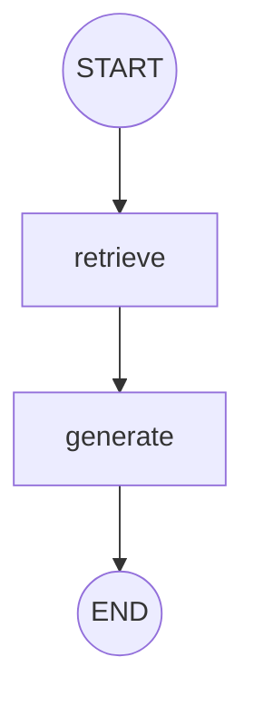

# Corrective RAG (CRAG) Implementation

This repository is dedicated to building and documenting a complete Corrective Retrieval-Augmented Generation (CRAG) pipeline. CRAG enhances standard RAG systems by introducing an evaluation and correction step: it grades the relevance of retrieved documents, performs query rewriting, and utilizes web search fallbacks when local documents are insufficient.

---

## Project Roadmap

Our implementation progresses from a simple baseline to a fully corrective graph workflow:
1. **[Current] Basic RAG**: Implement document loading, vector storage, retrieval, and generation using LangChain and LangGraph.
2. **Corrective RAG (CRAG)**: Introduce a retrieval grader, dynamic fallback routing, and web search integration (e.g., Tavily Search) to handle ambiguous or out-of-domain queries.

---

## Repository Structure

- [1_basic_rag.ipynb](1_basic_rag.ipynb): Jupyter Notebook containing the initial phase—a basic RAG pipeline orchestrated using LangGraph.
- `.gitignore`: Configured to ignore virtual environments, cache files, environment variables, and local Jupyter checkpoints.

---

## Phase 1: Basic RAG Architecture

The baseline implementation in `1_basic_rag.ipynb` consists of the following components:

### 1. Ingestion & Embedding Pipeline
- **Document Loading**: PyPDFLoader is used to read documents from a local `./documents/` directory.
- **Text Splitting**: Splits PDF texts using `RecursiveCharacterTextSplitter` with:
  - `chunk_size = 900`
  - `chunk_overlap = 150`
- **Vector Store**: Embeds chunks using OpenAI's `text-embedding-4-small` model and stores them in a local `FAISS` vector database.
- **Retriever**: Performs similarity search returning the top k = 4 most relevant chunks.

### 2. LangGraph Execution Workflow
The agent architecture uses LangGraph to manage state transitions.



- **State Representation**:
  ```python
  class State(TypedDict):
      question: str
      docs: List[Document]
      answer: str
  ```
- **Nodes**:
  - `retrieve`: Invokes the FAISS retriever and updates the state with the retrieved documents.
  - `generate`: Generates an answer using the `gpt-4o-mini` model prompted to answer strictly from the retrieved context.

---

## Getting Started

### Prerequisites
Make sure you have Python (version 3.9+) installed, along with Jupyter Notebook or the VS Code Jupyter extension.

### Setup Instructions

1. **Clone the repository**:
   ```bash
   git clone <repository-url>
   cd correctiverag
   ```

2. **Create a virtual environment & install dependencies**:
   ```bash
   python -m venv .venv
   .venv\Scripts\activate
   pip install langchain langchain-openai langchain-community langgraph faiss-cpu pypdf python-dotenv
   ```

3. **Configure Environment Variables**:
   Create a `.env` file in the root directory:
   ```env
   OPENAI_API_KEY=your_openai_api_key_here
   ```

4. **Prepare PDF Documents**:
   Create a folder named `documents` and place the target PDFs there:
   - `documents/introtoml.pdf`
   - `documents/samplebook.pdf`
   - `documents/docs32.pdf`

5. **Run the Notebook**:
   Open and execute [1_basic_rag.ipynb](1_basic_rag.ipynb) to test the baseline.

---

## Next Steps: Corrective RAG (CRAG)

To transition this to a fully Corrective RAG system, the graph will be updated with:
1. **Document Grader Node**: An LLM-based binary classifier evaluating if each retrieved document is relevant to the user query.
2. **Conditional Router**: Dynamic routing logic:
   - If all retrieved documents are relevant, proceed to Generate.
   - If any retrieved documents are irrelevant or context is missing, route to Query Rewrite followed by Web Search to retrieve supplementary context, then Generate.
