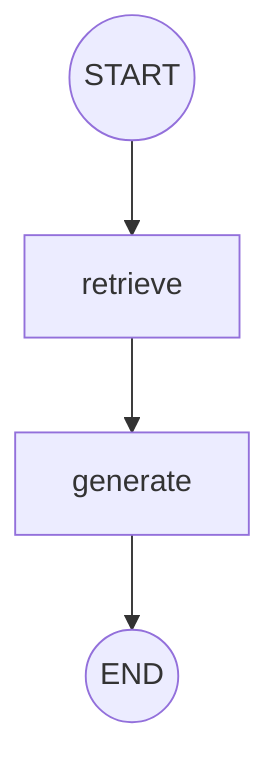
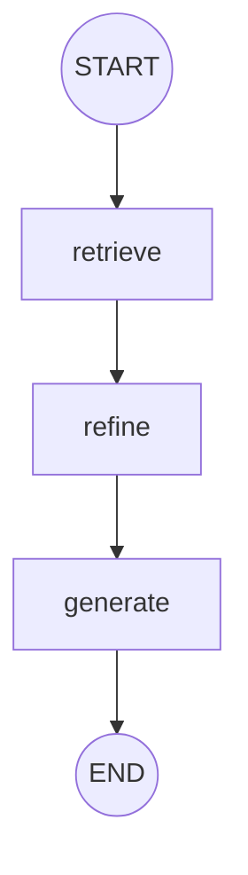
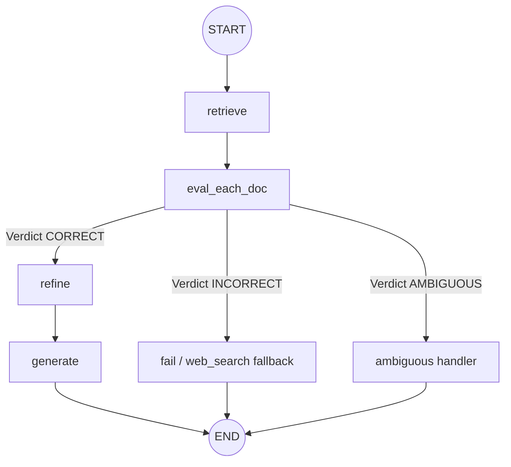

# Corrective RAG (CRAG) Implementation

This repository is dedicated to building and documenting a complete Corrective Retrieval-Augmented Generation (CRAG) pipeline. CRAG enhances standard RAG systems by introducing an evaluation and correction step: it grades the relevance of retrieved documents, performs query rewriting, and utilizes web search fallbacks when local documents are insufficient.

---

## Project Roadmap

Our implementation progresses from a simple baseline to a fully corrective graph workflow:
1. **Basic RAG**: Implement document loading, vector storage, retrieval, and generation using LangChain and LangGraph. (Completed in [1_basic_rag.ipynb](1_basic_rag.ipynb))
2. **Retrieval Refinement**: Add document parsing, sentence decomposition, and sentence-level relevance grading/filtering using an LLM to select only the sentences that directly address the user query. (Completed in [2_retrieval_refinement.ipynb](2_retrieval_refinement.ipynb))
3. **[Current] Retrieval Evaluation & Routing**: Introduce a retrieval evaluator node that scores retrieved chunks and determines a verdict (`CORRECT`, `INCORRECT`, or `AMBIGUOUS`) to dynamically route the query context downstream. (Completed in [3_retrieval_evaluator.ipynb](3_retrieval_evaluator.ipynb))
4. **Corrective RAG (CRAG)**: Introduce dynamic fallback web search integration (e.g., Tavily Search) and query rewriting to handle cases where local documents are incorrect or insufficient.

---

## Repository Structure

- [1_basic_rag.ipynb](1_basic_rag.ipynb): Jupyter Notebook containing the initial phase—a basic RAG pipeline orchestrated using LangGraph.
- [2_retrieval_refinement.ipynb](2_retrieval_refinement.ipynb): Jupyter Notebook containing the second phase—Retrieval Refinement with sentence-level relevance grading.
- [3_retrieval_evaluator.ipynb](3_retrieval_evaluator.ipynb): Jupyter Notebook containing the third phase—Retrieval Evaluation & Routing logic of Corrective RAG.
- `.gitignore`: Configured to ignore virtual environments, cache files, environment variables, and local Jupyter checkpoints.

---

## Phase 1: Basic RAG Architecture

The baseline implementation in [1_basic_rag.ipynb](1_basic_rag.ipynb) consists of the following components:

### 1. Ingestion & Embedding Pipeline
- **Document Loading**: PyPDFLoader is used to read documents from a local `./documents/` directory.
- **Text Splitting**: Splits PDF texts using `RecursiveCharacterTextSplitter` with:
  - `chunk_size = 900`
  - `chunk_overlap = 150`
- **Vector Store**: Embeds chunks using OpenAI's `text-embedding-4-small` model and stores them in a local `FAISS` vector database.
- **Retriever**: Performs similarity search returning the top k = 4 most relevant chunks.

### 2. LangGraph Execution Workflow
The agent architecture uses LangGraph to manage state transitions.



- **State Representation**:
  ```python
  class State(TypedDict):
      question: str
      docs: List[Document]
      answer: str
  ```
- **Nodes**:
  - `retrieve`: Invokes the FAISS retriever and updates the state with the retrieved documents.
  - `generate`: Generates an answer using the `gpt-4o-mini` model prompted to answer strictly from the retrieved context.

---

## Phase 2: Retrieval Refinement Architecture

The implementation in [2_retrieval_refinement.ipynb](2_retrieval_refinement.ipynb) focuses on minimizing noise in the context passed to the LLM. Instead of sending the full content of retrieved documents to the LLM, the context is broken down into individual sentences (strips), graded for relevance, and only the relevant sentences are used.

### 1. Ingestion Pipeline Updates
- **Source Books**: Loads `./documents/book1.pdf`, `./documents/book2.pdf`, and `./documents/book3.pdf`.
- **UTF-8 Sanitization**: Cleanses text chunks by ignoring non-UTF-8 characters during splitter preprocessing.
- **Embeddings**: Uses OpenAI's `text-embedding-3-small` embeddings and local `FAISS` index (`k = 4`).

### 2. LangGraph Execution Workflow with Refinement Node



- **Extended State Representation**:
  ```python
  class State(TypedDict):
      question: str
      docs: List[Document]
      strips: List[str]            # Decomposed sentence strips
      kept_strips: List[str]       # Sentences matching relevance criteria
      refined_context: str         # Recomposed internal knowledge context
      answer: str
  ```

- **Nodes**:
  - `retrieve`: Retrieves the top 4 documents matching the query.
  - `refine`: Performs sentence-level filtering:
    1. Splits the retrieved context into sentences using regex: `re.split(r"(?<=[.!?])\s+", text)`. Discards sentences <= 20 characters.
    2. Runs each sentence strip through an LLM relevance classifier (`KeepOrDrop` model using `gpt-4o-mini` structured output).
    3. Joins the kept sentences together into `refined_context`.
  - `generate`: Generates a response strictly based on `refined_context`. If no context was kept, it returns a fallback message: *"I don't know based on the provided books."*

---

## Phase 3: Retrieval Evaluation & Routing Architecture

The implementation in [3_retrieval_evaluator.ipynb](3_retrieval_evaluator.ipynb) adds a scoring and decision-making step to classify the retrieved documents and route the query accordingly.

### 1. Relevance Scoring
- **LLM Evaluator**: Chunks are individually graded by `gpt-4o-mini` using structured output (`DocEvalStore` containing `score` and `reason`).
- **Verdict Rules**:
  - **CORRECT**: If at least one retrieved chunk scores above the upper threshold (`upper_t = 0.7`).
  - **INCORRECT**: If all retrieved chunks score below the lower threshold (`lower_t = 0.3`).
  - **AMBIGUOUS**: Mixed relevance signals (no chunk > `upper_t`, but not all < `lower_t`).

### 2. LangGraph Execution Workflow with Routing



- **Extended State Representation**:
  ```python
  class State(TypedDict):
      question: str
      docs: List[Document]
      good_docs: List[Document]    # Documents meeting evaluation threshold
      verdict: str                 # CORRECT, INCORRECT, or AMBIGUOUS
      reason: str                  # Explanation for verdict
      strips: List[str]            # Decomposed sentence strips
      kept_strips: List[str]       # Sentences matching relevance criteria
      refined_context: str         # Recomposed internal knowledge context
      answer: str
  ```

- **Nodes**:
  - `retrieve`: Retrieves relevant documents from FAISS index.
  - `eval_each_doc`: Evaluates all retrieved documents using structured criteria.
  - `refine`: Sentence decomposition and filtering of good documents.
  - `generate`: Generates tutor response using `refined_context`.
  - `fail`: Fallback node that logs/outputs a failure message (intended for web search integration).
  - `ambiguous`: Handles mixed signals and outputs a clarifying message.

---

## Getting Started

### Prerequisites
Make sure you have Python (version 3.9+) installed, along with Jupyter Notebook or the VS Code Jupyter extension.

### Setup Instructions

1. **Clone the repository**:
   ```bash
   git clone <repository-url>
   cd correctiverag
   ```

2. **Create a virtual environment & install dependencies**:
   ```bash
   python -m venv .venv
   .venv\Scripts\activate
   pip install langchain langchain-openai langchain-community langgraph faiss-cpu pypdf python-dotenv pydantic
   ```

3. **Configure Environment Variables**:
   Create a `.env` file in the root directory:
   ```env
   OPENAI_API_KEY=your_openai_api_key_here
   ```

4. **Prepare PDF Documents**:
   Create a folder named `documents` and place the target PDFs there:
   - For Basic RAG: `documents/introtoml.pdf`, `documents/samplebook.pdf`, `documents/docs32.pdf`
   - For Retrieval Refinement: `documents/book1.pdf`, `documents/book2.pdf`, `documents/book3.pdf`

5. **Run the Notebooks**:
   - Run [1_basic_rag.ipynb](1_basic_rag.ipynb) to test the baseline.
   - Run [2_retrieval_refinement.ipynb](2_retrieval_refinement.ipynb) to test retrieval refinement with relevance filtering.
   - Run [3_retrieval_evaluator.ipynb](3_retrieval_evaluator.ipynb) to test retrieval evaluation and routing.

---

## Next Steps: Corrective RAG (CRAG)

The next step is to evolve this pipeline into a fully Corrective RAG system by adding:
1. **Query Rewrite**: If local knowledge is graded INCORRECT, rewrite the user query to optimize it for search engines.
2. **Web Search Integration**: Connect the `fail` / `web_search` node to a live web search tool (such as Tavily Search) to pull external context when local database lookup yields insufficient or incorrect information.
